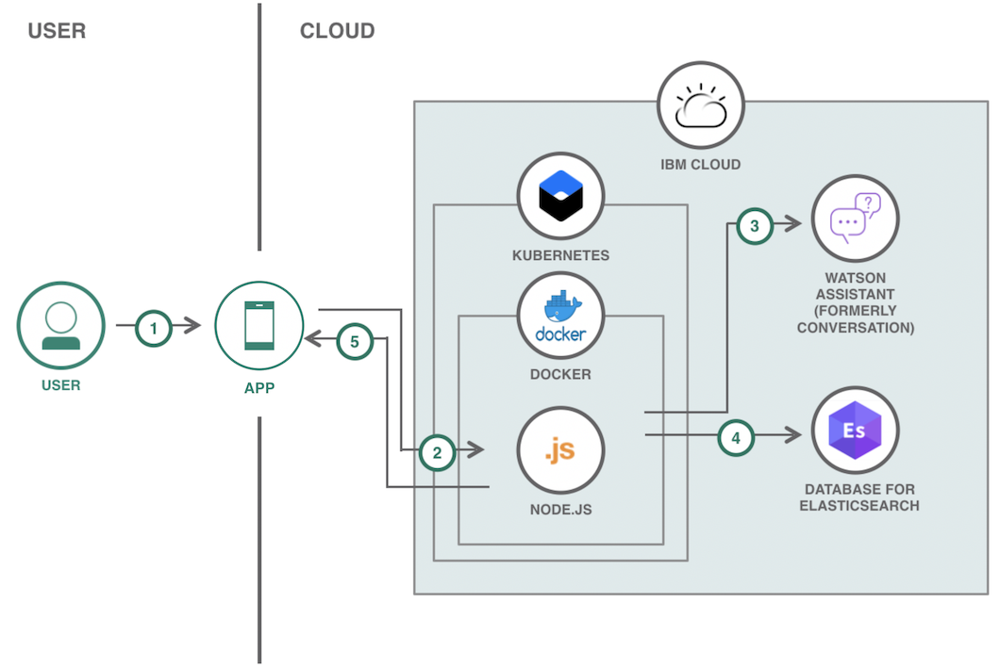
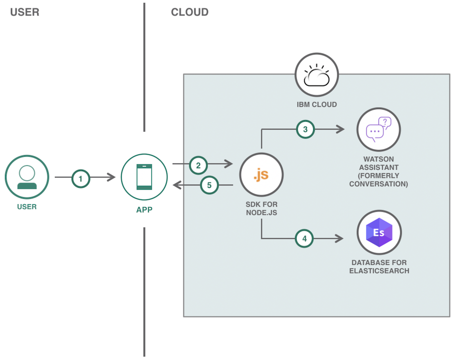

[](https://travis-ci.com/IBM/elasticsearch-chatbot)

# Elasticsearch Chatbot

> NOTE: This code pattern is based on the chatbot that is being used for the [IBM Developer mobile application](https://itunes.apple.com/us/app/ibm-developer/id1450996651).

In this Code Pattern, we will create a chatbot using Watson Assistant, Elasticsearch, and Node.js. The Node.js application can run on either Kubernetes or Cloud Foundry. This chatbot uses TV shows data from [TV Maze](http://www.tvmaze.com/api) to make recommendations and provide show information.

After completing this pattern, you will understand how to:

* Create a chatbot end to end
* Deploy and run a Node.js application on Kubernetes and/or Cloud Foundry

# Architecture

## Kubernetes



## Cloud Foundry



1. User interacts with chatbot from the React UI of the mobile application by asking a question via text.
2. React UI sends User's message to the Node.js backend on Cloud Foundry. 
3. The Node.js backend sends the message to Watson Assistant to determine the intent and entities of the User's message.
4. The Node.js backend querys the Elasticsearch database based on the intents and entities processed by Watson Assistant.
5. The response and results are sent to the React UI.

# Steps

Follow these steps to setup and run this code pattern on the Cloud. The steps are described in detail below.

1. [Clone the repo](#1-clone-the-repo)
2. [Prerequisites](#2-prerequisites)
3. [Deploy to IBM Cloud](#3-deploy-to-ibm-cloud)

## 1. Clone the repo

Clone the `elasticsearch-chatbot` repo locally. In a terminal, run:

```bash
git clone https://github.com/IBM/elasticsearch-chatbot
cd elasticsearch-chatbot
```

## 2. Prerequisites

* [IBM Cloud account](https://cloud.ibm.com/registration)
* [IBM Cloud CLI](https://cloud.ibm.com/docs/cli?topic=cloud-cli-ibmcloud-cli&locale=en-US#overview)
* [NodeJS](https://nodejs.org/en/download/)
* [NPM](https://www.npmjs.com/get-npm)
* Relevant Node Components: Use `npm install` in `/app` and `/web`
* [Docker](https://www.docker.com/products/docker-desktop) (if using Kubernetes)

## 3. Deploy to IBM Cloud

* [Kubernetes](#kubernetes)
* [Cloud Foundry](#cloud-foundry)

### Kubernetes

1. To allow changes to `/app` or `/web`, create a repo on [Docker Cloud](https://cloud.docker.com/) where the new modified containers will be pushed to.
> NOTE: If a new repo is used for the Docker containers, the container `image` will need to be modified to the name of the new repo used in [deploy-app.yml](deploy-app.yml) and/or [deploy-web.yml](deploy-web.yml).

```bash
export DOCKERHUB_USERNAME=<your-dockerhub-username>

docker build -t $DOCKERHUB_USERNAME/elasticsearch-chatbot-app:latest app/
docker build -t $DOCKERHUB_USERNAME/elasticsearch-chatbot-web:latest web/

docker login

docker push $DOCKERHUB_USERNAME/elasticsearch-chatbot-app:latest
docker push $DOCKERHUB_USERNAME/elasticsearch-chatbot-web:latest
```

2. Provision the [IBM Cloud Kubernetes Service](https://cloud.ibm.com/kubernetes/catalog/cluster) and follow the set of instructions for creating a Container and Cluster based on your cluster type, `Standard` vs `Lite`.

* Login to the IBM Cloud using the [Developer Tools CLI](https://www.ibm.com/cloud/cli):
> NOTE use `--sso` if you have a single sign on account, or delete for username/password login

```bash
ibmcloud login --sso
```

* Set the Kubernetes environment to work with your cluster:

```bash
ibmcloud cs cluster-config $CLUSTER_NAME
```

The output of this command will contain a KUBECONFIG environment variable that must be exported in order to set the context. Copy and paste the output in the terminal window. An example is:

```bash
export KUBECONFIG=/home/rak/.bluemix/plugins/container-service/clusters/Kate/kube-config-prod-dal10-<cluster_name>.yml
```

3. Provision a [Database for Elasticsearch](https://cloud.ibm.com/catalog/services/databases-for-elasticsearch).

3. Provision a [Watson Assistant](https://cloud.ibm.com/catalog/services/watson-assistant).

4. Import the Skill data from `skill-TV-Shows.json` to your instance of Watson Assistant. Create an Assistant that incorporates the `TV Shows` skill.


5. Create Service Credentials for the Elasticsearch Database.


6. Update the following in the [deploy-app.yml](deploy-app.yml) file:

* `ELASTIC_BASE_URL` with the `connection -> https -> composed` URL from your generated Service Credentials from the Elasticsearch Database.


* `WATSON_USERNAME` with the username of the Service Credentials of your Assistant of Watson Assistant.


* `WATSON_PASSWORD` with the password of the Service Credentials of your Assistant of Watson Assistant.


* `WATSON_API_URL` with the assistant URL of the Assistant Details of your Assistant of Watson Assistant.
> NOTE: Only include the part of the URL up to and including `/api` 
 


* `WATSON_ASSISTANT_ID` with the assistant ID of the Assistant Details of your Assistant of Watson Assistant.


#### Lite Cluster Instructions

7. Get the workers for your Kubernetes cluster:

```bash
ibmcloud cs workers <mycluster>
```
and locate the `Public IP`. This IP is used to access the App and UI on the Cloud. Update the `env` value for `REACT_APP_API_BASE_URL` in [deploy-web.yml](deploy-web.yml) to `http://<Public IP>:32001`.

8. To deploy the services to the IBM Cloud Kubernetes Service, run:

```bash
kubectl apply -f deploy-app.yml
kubectl apply -f deploy-web.yml

## Confirm the services are running - this may take a minute
kubectl get pods
```

9. To populate the Elasticsearch Database, run `curl http://PUBLIC_IP:32001/api/v1/data -H "Content-Type: application/json" -X PUT -d '{"total": <TOTAL>}'` Total is optional and if used, refers to the maximum number of potential shows to add to the database.
> NOTE: This chatbot only works for US shows and streaming services. There are maximum 42,000+ shows available through the API used.

10. Use `http://PUBLIC_IP:32000` to access the React UI.

#### Standard Cluster Instructions

7. Run `ibmcloud cs cluster-get <CLUSTER_NAME>` and locate the `Ingress Subdomain` and `Ingress Secret`. This is the domain of the URL that is to be used to access the App and UI on the Cloud. Update the `env` value for `REACT_APP_API_BASE_URL` in [deploy-web.yml](deploy-web.yml) to `https://api.<Ingress Subdomain>`. In addition, update the `host` and `secretName` in [ingress-app.yml](ingress-app.yml) to `api.<Ingress Subdomain>` and `<Ingress Secret>` and [ingress-web.yml](ingress-web.yml) to `<Ingress Subdomain>` and `<Ingress Secret>`.

8. To deploy the services to the IBM Cloud Kubernetes Service, run:

```bash
kubectl apply -f deploy-app.yml
kubectl apply -f deploy-web.yml

## Confirm the services are running - this may take a minute
kubectl get pods

## Update protocol being used to https
kubectl apply -f ingress-app.yml
kubectl apply -f ingress-web.yml
```

9. To populate the Elasticsearch Database, do one of the following:

*  Run `curl https://api.<INGRESS_SUBDOMAIN>/api/v1/data -H "Content-Type: application/json" -X PUT -d '{"total": <TOTAL>}'` Total is optional and if used, refers to the maximum number of potential shows to add to the database.
> NOTE: This chatbot only works for US shows and streaming services. There are maximum 42,000+ shows available through the API used.

* Use one of the provided data sets in `/data` by running `curl https://api.<INGRESS_SUBDOMAIN>/api/v1/data -H "Content-Type: application/json" -X PUT -d '@data/<DATA_FILE>'` `<DATA_FILE>` can be either `small-dataset.json` or `large-dataset.json`

10. Use `https://<INGRESS_SUBDOMAIN>` to access the React UI.

11. Here are some example messages to send to the chatbot:

* `What comedy shows are on ABC tonight?`
* `What drama shows do you recommend?`
* `Tell me more about Game of Thrones`
* `When is Jeopardy on?`

### Cloud Foundry

1. Provision two [SDK for Node.js](https://cloud.ibm.com/catalog/starters/sdk-for-nodejs) applications. One will be for `./app` and the other will be for `./web`.

2. Provision a [Database for Elasticsearch](https://cloud.ibm.com/catalog/services/databases-for-elasticsearch).

3. Provision a [Watson Assistant](https://cloud.ibm.com/catalog/services/watson-assistant).

4. Import the Skill data from `skill-TV-Shows.json` to your instance of Watson Assistant. Create an Assistant that incorporates the `TV Shows` skill.


5. Create Service Credentials for the Elasticsearch Database.


6. Connect the Elasticsearch Database and Watson Assistant with the Node.js app by going to *Connections* on the dashboard of the app provisioned and clicking *Create Connection*. Locate the Elasticsearch Database and Watson Assistant you provisioned and press *connect*.


7. Update `REACT_APP_API_BASE_URL` in `./web/.env` to `https://<APP-NAME>.<APP-DOMAIN>`


8. From the `./web` directory, run `npm run build` so that the React front end can be run on Cloud Foundry with a static buildpack.

9. Update the following in the [manifest.yml](manifest.yml) file:

* `name` for both Cloud Foundry application names provisioned from Step 1.


* `services` with the name of the Elasticsearch Database and Watson Assistant services provisioned from Steps 2 and 3.


* `ELASTIC_BASE_URL` with the `connection -> https -> composed` URL from your generated Service Credentials from the Elasticsearch Database.


* `WATSON_USERNAME` with the username of the Service Credentials of your Assistant of Watson Assistant.


* `WATSON_PASSWORD` with the password of the Service Credentials of your Assistant of Watson Assistant.


* `WATSON_API_URL` with the assistant URL of the Assistant Details of your Assistant of Watson Assistant.
> NOTE: Only include the part of the URL up to and including `/api` 
 


* `WATSON_ASSISTANT_ID` with the assistant ID of the Assistant Details of your Assistant of Watson Assistant.


10. To deploy the services to IBM Cloud Foundry, go to one of the dashboards of the apps provisioned from Step 1 and follow the *Getting Started* instructions for connecting and logging in to IBM Cloud from the console (Step 3 of *Getting Started*). Once logged in, run `ibmcloud app push` from the root directory.

11. To populate the Elasticsearch Database, do one of the following:

*  Run `curl https://<APP-NAME>.<APP-DOMAIN>/api/v1/data -H "Content-Type: application/json" -X PUT -d '{"total": <TOTAL>}'` Total is optional and if used, refers to the maximum number of potential shows to add to the database.
> NOTE: This chatbot only works for US shows and streaming services. There are maximum 42,000+ shows available through the API used.

* Use one of the provided data sets in `/data` by running `curl https://<APP-NAME>.<APP-DOMAIN>/api/v1/data -H "Content-Type: application/json" -X PUT -d '@data/<DATA_FILE>'` `<DATA_FILE>` can be either `small-dataset.json` or `large-dataset.json`

12. Use `https://<WEB-NAME>.<WEB-DOMAIN>` to access the React UI.

13. Here are some example messages to send to the chatbot:

* `What comedy shows are on ABC tonight?`
* `What drama shows do you recommend?`
* `Tell me more about Game of Thrones`
* `When is Jeopardy on?`

# License

This code pattern is licensed under the Apache License, Version 2. Separate third-party code objects invoked within this code pattern are licensed by their respective providers pursuant to their own separate licenses. Contributions are subject to the [Developer Certificate of Origin, Version 1.1](https://developercertificate.org/) and the [Apache License, Version 2](https://www.apache.org/licenses/LICENSE-2.0.txt).

[Apache License FAQ](https://www.apache.org/foundation/license-faq.html#WhatDoesItMEAN)
